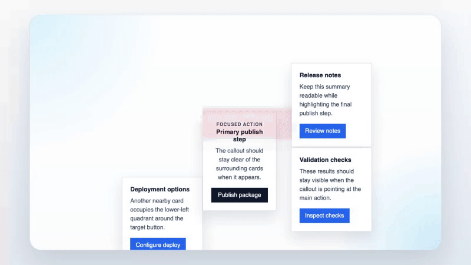

# @immense/vue-pom-generator

`@immense/vue-pom-generator` is a Vite plugin for Vue 3 that does two compile-time jobs:

1. it injects a test-id attribute into interactive elements in `.vue` templates
2. it turns the collected ids into a Page Object Model library for Playwright, with aggregated or split TypeScript output, optional Playwright fixtures, and optional C# output

If you already use Playwright with `getByTestId`, the point is simple: this package removes the repetitive work of keeping test ids in sync with Vue templates and then hand-writing page objects around those ids.

## What this does

- **Injects test ids during Vue compilation, not at runtime.** It hooks into the Vue template compiler and rewrites the compiled template output.
- **Uses real template signals to name ids and methods.** Click handlers, `v-model`, `id`/`name`, `:to`, wrapper configuration, and a few targeted fallbacks all feed the generated API.
- **Generates TypeScript POM output as either one aggregate or split per class, always with a stable `index.ts` barrel.**
- **Describes generated Playwright locators** with deterministic human-readable labels via `Locator.describe()`.
- **Can generate Playwright fixtures** so tests can request `userListPage` instead of constructing `new UserListPage(page)` manually.
- **Can fail fast on unnameable wrapper-button actions** so complex inline handlers do not silently degrade into low-signal generated APIs.
- **Can emit a single C# POM file** for Playwright .NET consumers.
- **Exposes `virtual:testids`, `virtual:pom-manifest`, `virtual:webmcp-manifest`, and `virtual:webmcp-bridge`** so your app can inspect collected ids, generated POM metadata, consume WebMCP-oriented tool metadata, or opt into a generated WebMCP runtime bridge.
- **Ships ESLint rules** to remove legacy manually-authored test ids, ban raw `page` fixture usage in spec callbacks, and discourage raw locator actions on generated getters.

## What this does not do

- **It is not a runtime DOM crawler.** It only knows what it can learn from Vue SFC templates and router introspection.
- **It does not fully understand arbitrary wrapper components automatically.** There is some wrapper inference for simple local SFCs and some naming conventions, but serious design-system components still need `injection.nativeWrappers`.
- **It does not fully fill route params for you.** Generated `goTo()` / `goToSelf()` methods use the discovered route template literally. A route like `/users/:id` still needs a real `/users/123` when you actually navigate.
- **It does not auto-attach every file in `pom/custom`.** Custom helpers are imported, but they only affect generated classes when you explicitly configure attachments, or when they match the built-in `Toggle` / `Checkbox` widget conventions.
- **It does not make override classes globally replace generated classes.** `pom/overrides` only changes generated fixture instantiation. Direct imports from the generated barrel still give you the generated class unless you import your override yourself.
- **It does not magically make your app WebMCP-controllable unless you opt into a runtime.** The manifest is metadata; actual tool registration still requires either `virtual:webmcp-bridge` or the browser-safe `@immense/vue-pom-generator/webmcp-runtime` helper plus a `navigator.modelContext` implementation.
- **The C# emitter is not feature-parity with the TypeScript emitter.** It emits locator/action classes, but not Playwright fixtures, not helper attachments, and not the same route helper surface.

## A minimal Vue example

Given a view like this:

```vue
<!-- src/views/UserEditorPage.vue -->
<template>
  <form>
    <input v-model="emailAddress" />
    <button @click="save">Save</button>
  </form>
</template>
```

The current implementation will generate a surface in this shape:

```html
<input data-testid="UserEditorPage-EmailAddress-input">
<button data-testid="UserEditorPage-Save-button">Save</button>
```

```ts
export class UserEditorPage extends BasePage {
  get EmailAddressInput() { /* Playwright locator */ }
  get SaveButton() { /* Playwright locator */ }

  async typeEmailAddress(text: string, annotationText = "") { /* ... */ }
  async clickSave(wait: boolean = true, annotationText = "") { /* ... */ }
}
```

That example is intentionally small, but it shows the real contract:

- the Vue template stays close to normal app code
- the test ids are derived at compile time
- the generated class exposes both raw locators and typed action methods

## How ids are actually derived today

The generator does not use one naming trick. It layers several signals.

- **Click actions** prefer semantic handler names such as `save`, `openDetails`, or `runImport`.
- **Click handlers are instrumented** so generated Playwright helpers can wait on deterministic `__testid_event__` runtime events.
- **Inputs and wrapper components** prefer `v-model`, wrapper `valueAttribute`, or related model-like bindings.
- **Native elements** also consider `id` / `name` attributes.
- **Router links / `:to` bindings** can contribute route-based naming and typed navigation return types when the target can be resolved.
- **Wrapper components** can be explicit (`nativeWrappers`) or inferred from simple local SFC templates.
- **Fallback naming exists, but it is intentionally conservative.** That is why `generation.nameCollisionBehavior` exists.
- **Wrapper-action generation fails fast.** The generator blocks button-like wrapper `:handler` expressions that it cannot turn into a semantic action name.

Important limit: wrapper inference is helpful, not magical. The current implementation recursively inspects simple local SFC templates for the first inferable primitive (`input`, `textarea`, `select`, `button`, `vselect`, radio/checkbox inputs). It also recognizes some naming patterns like `*Button`. For anything more complex, configure `nativeWrappers` explicitly.

## Playwright before/after examples

### 1) Raw selectors vs generated POM methods

**Before**

```ts
import { test, expect } from "@playwright/test";

test("saves a user", async ({ page }) => {
  await page.goto("/users/new");
  await page.getByTestId("UserEditorPage-EmailAddress-input").fill("alice@example.com");
  await page.getByTestId("UserEditorPage-Save-button").click();
  await expect(page.getByText("Saved")).toBeVisible();
});
```

**After**

```ts
import { test, expect } from "@playwright/test";
import { UserEditorPage } from "../tests/playwright/__generated__";

test("saves a user", async ({ page }) => {
  const userEditorPage = new UserEditorPage(page);
  await userEditorPage.typeEmailAddress("alice@example.com");
  await userEditorPage.clickSave();
  await expect(page.getByText("Saved")).toBeVisible();
});
```

Why this is better:

- selector strings stop leaking into tests
- refactors are localized to generated output instead of every test file
- you still keep access to raw locators when you need them

Without the generator, you still can write stable Playwright tests, but you keep manually maintaining both the selector strings and the page-object layer around them.

### 2) Manual page-object construction vs generated fixtures

**Before**

```ts
import { test, expect } from "@playwright/test";
import { UserListPage } from "../tests/playwright/__generated__";

test("shows the list", async ({ page }) => {
  const userListPage = new UserListPage(page);
  await userListPage.goTo();
  await expect(userListPage.CreateButton).toBeVisible();
});
```

**After**

```ts
import { test, expect } from "../tests/playwright/__generated__/fixtures.g";

test("shows the list", async ({ userListPage }) => {
  await userListPage.goTo();
  await expect(userListPage.CreateButton).toBeVisible();
});
```

Why this is better:

- less setup noise in tests
- fixture types stay aligned with generated classes
- if `tests/playwright/pom/overrides/UserListPage.ts` exists, the fixture will instantiate that override class automatically

Without fixtures, you still use the generated POMs, but every test has to construct them manually.

### 3) Nested helper calls vs flattened helper methods

Suppose you have a custom grid helper in `tests/playwright/pom/custom/Grid.ts`.

**Without `flatten`**

```ts
test("filters the grid", async ({ usersPage }) => {
  await usersPage.grid.Search("alice@example.com");
});
```

**With `flatten: true`**

```ts
test("filters the grid", async ({ usersPage }) => {
  await usersPage.Search("alice@example.com");
});
```

Why this is better:

- the test reads like the page API, not the internal helper graph
- the page still keeps the explicit `grid` property when you want it

Without `flatten`, helper composition is still available; it is just more explicit and more nested.

## Install

```sh
npm install @immense/vue-pom-generator
```

Peer Vite support: Vite 5, 6, or 7.

Exports:

- `createVuePomGeneratorPlugins()`
- `vuePomGenerator()` (alias)
- `defineVuePomGeneratorConfig()`
- `defineNuxtPomGeneratorConfig()`
- `@immense/vue-pom-generator/eslint`

## Basic Vue/Vite setup

```ts
import { defineConfig } from "vite";
import { defineVuePomGeneratorConfig, vuePomGenerator } from "@immense/vue-pom-generator";

const pomConfig = defineVuePomGeneratorConfig({
  vueOptions: {
    script: { defineModel: true, propsDestructure: true },
  },
  logging: { verbosity: "info" },
  injection: {
    attribute: "data-testid",
    viewsDir: "src/views",
    componentDirs: ["src/components"],
    layoutDirs: ["src/layouts"],
    wrapperSearchRoots: ["../shared-ui/src/components"],
    nativeWrappers: {
      AppButton: { role: "button" },
      AppTextField: { role: "input" },
      AppRadioGroup: { role: "radio", requiresOptionDataTestIdPrefix: true },
    },
    excludeComponents: ["LegacyWidget"],
    existingIdBehavior: "error",
  },
  generation: {
    emit: ["ts", "csharp"],
    csharp: {
      namespace: "MyProject.Tests.Generated",
    },
    outDir: "tests/playwright/__generated__",
    nameCollisionBehavior: "error",
    router: {
      entry: "src/router/index.ts",
      moduleShims: {
        "@/config/app-insights": {
          getAppInsights: () => null,
        },
        "@/stores/alerts": ["useAlertsStore"],
      },
    },
    playwright: {
      fixtures: true,
      outputStructure: "split",
      customPoms: {
        dir: "tests/playwright/pom/custom",
        importAliases: {
          Grid: "UserGridHelper",
        },
        attachments: [
          {
            className: "Grid",
            propertyName: "grid",
            attachWhenUsesComponents: ["DataGrid"],
            attachTo: "pagesAndComponents",
            flatten: true,
          },
        ],
      },
    },
  },
});

export default defineConfig({
  plugins: [...vuePomGenerator(pomConfig)],
});
```

## Basic Nuxt setup

```ts
import { defineNuxtConfig } from "nuxt/config";
import { defineNuxtPomGeneratorConfig, vuePomGenerator } from "@immense/vue-pom-generator";

const pomConfig = defineNuxtPomGeneratorConfig({
  generation: {
    outDir: "tests/playwright/__generated__",
  },
});

export default defineNuxtConfig({
  vite: {
    plugins: [
      ...vuePomGenerator(pomConfig),
    ],
  },
});
```

Nuxt projects are auto-detected from standard project artifacts, and their pages/layouts/components are resolved from Nuxt's own config. That means custom page directories such as `dir.pages = "views"` come from `nuxt.config`, while component directories are picked up automatically from Nuxt conventions/config. `defineNuxtPomGeneratorConfig(...)` is optional, but it keeps the config surface Nuxt-specific at type-check time.

### Important Vite ownership rule

By default, this package creates and returns its own `@vitejs/plugin-vue` instance.

That means:

- **standard Vue app**: spread `...vuePomGenerator(config)` and do **not** separately pass `vue()` into the same helper
- **app-owned Vue plugin / Nuxt / special Vite setup**: set `vuePluginOwnership: "external"`, add `vue()` yourself, and let this package patch the resolved Vue plugin instead

Example:

```ts
import vue from "@vitejs/plugin-vue";
import { defineConfig } from "vite";
import { defineVuePomGeneratorConfig, vuePomGenerator } from "@immense/vue-pom-generator";

const pomConfig = defineVuePomGeneratorConfig({
  vuePluginOwnership: "external",
});

export default defineConfig({
  plugins: [
    vue(),
    ...vuePomGenerator(pomConfig),
  ],
});
```

Nuxt-style routing also uses the resolved app-owned Vue plugin. In practice, Nuxt projects are auto-detected and use external Vue plugin ownership automatically.

## What gets generated

By default, generation writes to `tests/playwright/__generated__`.

TypeScript output:

- default (`generation.playwright.outputStructure: "aggregated"`):
  - `page-object-models.g.ts` — aggregated generated classes
  - `index.ts` — stable barrel re-exporting `page-object-models.g`
- split mode (`generation.playwright.outputStructure: "split"`):
  - one `*.g.ts` file per generated class
  - `index.ts` — stable barrel re-exporting the split files
- `_pom-runtime/` — copied runtime support files used by the generated TypeScript output in either mode

Optional Playwright fixture output:

- `fixtures.g.ts` next to the POMs by default
- or a custom directory / file path when configured

Optional C# output:

- `page-object-models.g.cs`

If you emit outside a `__generated__` path, the generator also manages `.gitattributes` entries for generated files.

## Actual Vite dev/build behavior

This is important if you are deciding whether the tool will fit into a real codebase.

- **Dev server:** on startup, it scans the configured Vue page/component/layout directories (or the directories resolved from Nuxt config in Nuxt mode), compiles each `.vue` file into a snapshot, writes the configured TypeScript outputs once, then batches add/change/delete events and regenerates incrementally.
- **Build:** it generates from the richest build pass it sees, which matters because Vite can run multiple passes (for example SSR plus client). The generator avoids letting a thinner pass clobber a richer one.
- **Always-on virtual modules:** `virtual:testids`, `virtual:pom-manifest`, `virtual:webmcp-manifest`, and `virtual:webmcp-bridge` are registered whether generation is enabled or disabled.
- **Generation can be disabled:** `generation: false` still keeps compile-time test-id injection and the virtual modules, but skips emitted POM files.

## Router-aware navigation: the real semantics

This package has two router-related behaviors, and they are easy to overstate.

### 1) Typed navigation methods from `:to`

When the generator can statically resolve a `:to` target, it can emit navigation methods that return the target POM type.

That enables patterns like:

```ts
await userListPage.goToCreateUser().typeEmailAddress("alice@example.com");
```

What is actually supported well today:

- literal string paths, such as `:to="'/users'"`
- object literals with `name` or `path`, such as `:to="{ name: 'users' }"`
- object literals with `params` keys, enough for target-type resolution

What is not fully supported:

- arbitrary computed `:to` expressions
- parameter-aware `goToSelf()` URL filling
- exposing rich route-param metadata on the generated POM surface

### 2) View-level `route`, `goTo()`, and `goToSelf()`

When `generation.router` is enabled, each view POM gets:

- `static readonly route: { template: string } | null`
- `async goTo()`
- `async goToSelf()`

Important caveats:

- `goToSelf()` calls `page.goto(...)`, resolving the route template against `PLAYWRIGHT_RUNTIME_BASE_URL`, `PLAYWRIGHT_TEST_BASE_URL`, or `VITE_PLAYWRIGHT_BASE_URL` when those runtime env vars are present
- a dynamic route template like `/users/:id` stays `/users/:id`
- if a component is matched by multiple routes, the generator currently picks one route template (the shortest one)

So the safe rule is:

- use generated `goTo()` for simple/static routes
- for dynamic routes, navigate with a real URL yourself or wrap that behavior in your override/custom code

### Why `moduleShims` exists

Vue-router introspection SSR-loads your router entry through Vite. Real routers often import browser-only or application-only modules that do not belong in an introspection pass.

`moduleShims` exists so you can replace those imports just for route discovery.

- `string[]` means “create no-op exported functions with these names”
- `Record<string, fn>` means “use these exact shim implementations”
- wildcard `*` exports are not supported

Without `moduleShims`, router introspection can fail even though your app itself runs fine.

## `pom/custom` and `pom/overrides`: what those folders really mean

These two directories solve different problems.

### `pom/custom`

Default: `tests/playwright/pom/custom`

This directory is for handwritten helper classes that the generated TypeScript output can import.

It is the default helper directory even if you omit `generation.playwright.customPoms` entirely.

Actual current behavior:

- the generator scans the directory **non-recursively**
- it imports top-level `.ts` files only
- it expects the file basename to match the exported class name (`Grid.ts` → `export class Grid {}`)
- the helper files are available to generated output; they are **not** automatically attached everywhere

What it is for:

- wrappers around third-party widgets
- reusable page fragments with custom methods
- helper objects you want attached conditionally to generated pages/components

What it is not:

- a magic auto-discovery system that wires every helper into every page
- a replacement for `attachments`

### `pom/overrides`

Default convention: sibling `overrides/` next to `customPoms.dir`

If `customPoms.dir` is:

```txt
tests/playwright/pom/custom
```

then fixtures look for overrides in:

```txt
tests/playwright/pom/overrides
```

Actual current behavior:

- the override directory is inferred, not separately configurable
- generated fixtures check for `overrides/<ClassName>.ts`
- when the file exists, the fixture instantiates the override class instead of the generated class
- the generated POM barrel does **not** automatically re-export the override in place of the generated class

That means fixture override preference is real, but it is specifically a **fixture-time constructor preference**, not a global import replacement mechanism.

A typical override looks like this:

```ts
// tests/playwright/pom/overrides/UserListPage.ts
import { UserListPage as GeneratedUserListPage } from "../../__generated__";

export class UserListPage extends GeneratedUserListPage {
  async openFirstUser() {
    await this.clickOpen();
  }
}
```

## Helper imports, aliasing, conditional wiring, and `flatten`

This is where most people need precision.

### Helper imports

Every `.ts` file in `customPoms.dir` is available for import from the generated TypeScript output.

- in aggregated mode, helper files become imports in the shared aggregate
- in split mode, each generated file imports only the helpers it actually needs

Benefits:

- helpers are typechecked as normal TypeScript
- generated pages can compose them instead of duplicating logic

Without helper imports, generated classes only know about generated pages/components plus the built-in runtime support.

### `importAliases`

`importAliases` changes the **local import identifier** used in generated output.

Example:

```ts
customPoms: {
  importAliases: {
    Grid: "UserGridHelper",
  },
}
```

This is useful when:

- you want a clearer local helper name
- a helper name would otherwise collide with a generated POM class name

Important semantic detail: `attachments[].className` still refers to the helper's real exported class / file basename (`Grid`), **not** the alias (`UserGridHelper`).

Without `importAliases`, the generator uses the basename as-is.

### `importNameCollisionBehavior`

Current options:

- `"error"` (default)
- `"alias"`

Why it exists:

- the aggregated file can import both generated classes and handwritten helpers
- collisions are easy when a helper and a generated class share the same name

What happens:

- `"error"`: generation fails and tells you to rename or alias the helper
- `"alias"`: the generator auto-aliases the helper import (for example `GridCustom`)

Without this option, collisions would quietly create ambiguous generated code.

### Conditional helper wiring (`attachments`)

Attachments decide when a handwritten helper becomes a property on a generated page/component.

Example:

```ts
attachments: [
  {
    className: "Grid",
    propertyName: "grid",
    attachWhenUsesComponents: ["DataGrid"],
    attachTo: "pagesAndComponents",
    flatten: true,
  },
]
```

Actual semantics:

- the helper must exist in `customPoms.dir`
- the generated page/component must use at least one component named in `attachWhenUsesComponents`
- matching is based on the component usage collected from the Vue template, not runtime inspection
- the generated constructor instantiates the helper as `new Helper(page, this)`
- `attachTo` defaults to `"views"`
- `"pagesAndComponents"` is the clearer alias for `"both"`; both spellings are accepted for backward compatibility

Why it exists:

- you usually do not want every helper on every page
- helper attachment is often driven by the presence of a specific UI widget

Without attachments, your helper class can still exist, but generated POMs will not automatically expose it.

Important caveat: if the helper file is missing, the generator currently skips the attachment instead of failing.

### `flatten`

`flatten: true` tells the generator to create pass-through methods on the generated class that forward to the attachment.

If `Grid` has:

```ts
export class Grid {
  constructor(page: Page, owner: object) {}
  Search(text: string) {}
}
```

then the generated page can expose either:

```ts
page.grid.Search("alice@example.com");
```

or, with `flatten: true`:

```ts
page.Search("alice@example.com");
```

Actual current rules:

- only public instance methods are candidates
- method signatures are parsed from the helper class source
- complex/unsupported parameter shapes may prevent flattening for that method
- passthroughs are only emitted when the method name is unambiguous across flatten-enabled attachments
- passthroughs are skipped if they would collide with an existing generated method, attachment property, child component property, or widget property
- `flatten` affects methods, not fields/getters

Without `flatten`, helper composition still works; you just call through the helper property explicitly.

## Playwright fixtures: actual behavior and caveats

When `generation.playwright.fixtures` is enabled, the generator emits a strongly typed Playwright fixture module.

What it gives you:

- lower-camel-case fixtures for views (`UserListPage` → `userListPage`)
- lower-camel-case fixtures for component classes too
- `pomFactory.create(Ctor)` for ad-hoc page-object construction inside tests
- an `animation` option that wires the generated runtime's pointer settings
- per-page `renderers` overrides so you can keep the simple default callout or swap in a custom pointer / callout overlay implementation such as the bundled `floating-ui-callout.ts` renderer

Current caveats:

- there are no generated `openXPage` helpers; tests call `goTo()` explicitly when available
- override preference only affects fixture construction
- component fixtures are skipped when their lower-camel-case name would collide with reserved Playwright fixture names such as `page`, `context`, `browser`, or `request`
- an override class still needs a `new (page)`-compatible constructor because that is what fixtures call

By default the runtime uses a simple red fallback bubble. The example below uses the optional floating-ui renderer so the callout can auto-place around nearby UI and point back to the target with an arrow.

Example floating-ui callout sequence captured from the Playwright fixture coverage:



## TypeScript vs C# output

### TypeScript output

This is the main surface and the most complete implementation.

It includes:

- aggregated page/component classes
- child-component composition
- typed navigation return types from resolvable `:to`
- view-level `route` / `goTo()` / `goToSelf()` when router generation is enabled
- custom helper imports and attachments
- optional Playwright fixtures

### C# output

Enable with:

```ts
generation: {
  emit: ["ts", "csharp"],
}
```

What the C# emitter currently does well:

- emits a single `page-object-models.g.cs`
- generates locator properties and action methods
- handles dynamic test-id interpolation
- supports navigation methods that return target page classes when the target is known

What it currently does **not** do:

- generate Playwright fixtures
- generate helper attachments / flattening
- generate the same view-level `route` / `goToSelf()` helpers as TypeScript
- provide feature parity for click instrumentation (`annotationText` is effectively a no-op there)

So if you need the full ergonomic surface, TypeScript is the first-class output today.

## `virtual:testids`

This package registers a Vite virtual module named `virtual:testids`.

Usage:

```ts
import { pomManifest, testIdManifest, webMcpManifest } from "virtual:testids";

console.log(testIdManifest.UserEditorPage);
console.log(pomManifest.UserEditorPage.entries);
console.log(webMcpManifest.UserEditorPage.tools);
```

What it contains:

- an object keyed by component name
- `testIdManifest`: each value is a sorted array of collected test ids for that component
- `pomManifest`: richer per-component metadata including source file, generated locator/property names, and generated action names
- `webMcpManifest`: WebMCP-oriented tool metadata derived from the same semantic graph, including suggested tool names, parameter descriptions, and action names
- each manifest entry also carries `locatorDescription`, which matches the human-readable label used by generated Playwright locators
- each manifest entry may also carry `accessibility`, a compile-time review signal with static metadata, accessible-name hints, and `needsReview`

What it is good for:

- runtime inspection
- analytics / logging helpers that need the current generated ids
- debugging what the generator has collected and generated
- keeping manifest-driven tools aligned with the same locator descriptions shown in Playwright traces
- bootstrapping WebMCP integration without scraping emitted POM files or walking the DOM at runtime

What it is not:

- a generated source file on disk

## `virtual:pom-manifest`

This package also registers `virtual:pom-manifest` for consumers that only want the richer discoverability surface.

Usage:

```ts
import { pomManifest } from "virtual:pom-manifest";

console.log(pomManifest.UserEditorPage.sourceFile);
console.log(pomManifest.UserEditorPage.entries.map(entry => entry.generatedActionNames));
```

What it contains:

- an object keyed by component/page object model class name
- for each component: source file, whether it is a view or component, sorted test ids, and rich entry metadata
- for each entry: test id, semantic name, inferred role, generated property name, generated action names, collected compiler metadata when available, and accessibility review metadata when available

## `virtual:webmcp-manifest`

This package also registers `virtual:webmcp-manifest` for consumers that want a tool-oriented manifest aligned with WebMCP's declarative model.

Usage:

```ts
import { webMcpManifest } from "virtual:webmcp-manifest";

console.log(webMcpManifest.UserEditorPage.tools[0].toolName);
console.log(webMcpManifest.UserEditorPage.tools[0].params);
```

Example: bridge the manifest into a WebMCP runtime yourself with the browser-safe helper export:

```ts
import "@mcp-b/global";
import { registerWebMcpManifestTools } from "@immense/vue-pom-generator/webmcp-runtime";
import { webMcpManifest } from "virtual:webmcp-manifest";

const registration = registerWebMcpManifestTools({ manifest: webMcpManifest });

// later
registration.unregister();
```

What it contains:

- an object keyed by component/page object model class name
- for each component with supported form-like controls or button actions: one or more suggested tools
- for each tool: `toolName`, `toolDescription`, `toolAutoSubmit`, parameter metadata with `toolParamDescription`, and any generated action names that can drive submission or follow-up behavior
- parameterized selectors also carry `selectorTemplateVariables` so a runtime bridge can resolve test ids such as `foo-${key}-button`

What it is not:

- automatic DOM annotation with `toolname`, `tooldescription`, or `toolparamdescription`
- a runtime crawler or a replacement for explicit WebMCP authoring when your UI semantics need manual curation

## `virtual:webmcp-bridge`

This package also registers `virtual:webmcp-bridge` for consumers that want the generated manifest pre-bound to the current test-id attribute and ready to register as live tools.

Usage:

```ts
import "@mcp-b/global";
import { registerGeneratedWebMcpTools } from "virtual:webmcp-bridge";

const registration = registerGeneratedWebMcpTools();

// optional: scope to a subtree or a custom modelContext
// const registration = registerGeneratedWebMcpTools({ root: document.querySelector("#app")! });

// later
registration.unregister();
```

What it does:

- imports the browser-safe `@immense/vue-pom-generator/webmcp-runtime` helper for you
- binds the current generated `webMcpManifest`
- binds the current configured test-id attribute
- unregisters the generated tools on Vite HMR disposal so dev reloads do not leak duplicate registrations

Current bridge behavior:

- fills native text inputs / textareas, checkboxes, radios, and native selects generically
- attempts a best-effort combobox/select interaction path for `vselect`-style controls
- auto-clicks a tool's sole action only when the tool has no parameters; otherwise use the generated `submitAction` input to choose an action explicitly

## ESLint rules that actually ship

The package exports `@immense/vue-pom-generator/eslint`.

### `remove-existing-test-id-attributes`

This is the migration rule that pairs with `injection.existingIdBehavior`.

What it does:

- removes explicit static attributes like `data-testid="save-button"`
- removes bound forms like `:data-testid="buttonId"`
- supports custom attribute names such as `data-qa`
- also handles object-literal cases inside Vue SFC expressions/scripts that represent test-id attrs

Why it exists:

- mixed manual/generated ids are hard to reason about
- `existingIdBehavior: "error"` is much more usable when a fixer can clean existing code first

Recommended usage:

1. run the ESLint rule with `--fix`
2. switch `existingIdBehavior` to `"error"`
3. keep the rule in CI so manually-authored ids do not creep back in

Example flat config:

```ts
import vueParser from "vue-eslint-parser";
import { plugin as vuePomGeneratorEslint } from "@immense/vue-pom-generator/eslint";

export default [
  {
    files: ["**/*.vue"],
    languageOptions: {
      parser: vueParser,
      ecmaVersion: 2022,
      sourceType: "module",
    },
    plugins: {
      "@immense/vue-pom-generator": vuePomGeneratorEslint,
    },
    rules: {
      "@immense/vue-pom-generator/remove-existing-test-id-attributes": "error",
    },
  },
];
```

If you use a custom attribute:

```ts
rules: {
  "@immense/vue-pom-generator/remove-existing-test-id-attributes": ["error", { attribute: "data-qa" }],
}
```

### `no-raw-locator-action`

This rule exists too. It flags direct raw Playwright actions on generated PascalCase getters (for example calling `.click()` directly on a generated getter) so teams use the generated action methods instead.

### `no-page-fixture-in-specs`

This rule flags Playwright's default `page` fixture when it is destructured directly in `*.spec.*` test and hook callbacks.

What it does:

- flags `test("...", async ({ page }) => { ... })`
- flags hooks like `test.beforeEach(async ({ page }) => { ... })`
- ignores non-spec files such as custom fixtures/helpers
- ignores POM usage like `dashboardPage.page` because the rule is specifically about the raw fixture entry point

Why it exists:

- fixture-based POM tests are easier to refactor than raw `page`-driven tests
- it catches regressions where tests quietly slide back to `page.goto(...)` / `page.getBy...(...)`
- it makes the generator's Playwright-fixture story enforceable during refactors

Recommended usage:

1. enable generated fixtures in the generator
2. migrate specs from `({ page })` to generated fixtures like `({ dashboardPage })`
3. turn this rule on for `tests/playwright/**/*.spec.ts`

Example flat config:

```ts
import { plugin as vuePomGeneratorEslint } from "@immense/vue-pom-generator/eslint";

export default [
  {
    files: ["tests/playwright/**/*.spec.ts"],
    plugins: {
      "@immense/vue-pom-generator": vuePomGeneratorEslint,
    },
    rules: {
      "@immense/vue-pom-generator/no-page-fixture-in-specs": "error",
      "@immense/vue-pom-generator/no-raw-locator-action": "error",
    },
  },
];
```

## Configuration reference

The sections below follow the actual `VuePomGeneratorPluginOptions` shape from `plugin/types.ts`.

### Top-level options

#### `vueOptions`

- **What it does:** Forwards options to `@vitejs/plugin-vue`.
- **Why it exists:** You still need normal Vue compiler/plugin settings such as `defineModel`, `propsDestructure`, or template compiler tweaks.
- **Benefit:** You do not lose ordinary Vue plugin configuration just because this package owns the Vue plugin by default.
- **Without it:** the Vue plugin uses its normal defaults.
- **Example:**

  ```ts
  vueOptions: {
    script: { defineModel: true, propsDestructure: true },
  }
  ```

#### `vuePluginOwnership`

- **What it does:** Chooses whether this package creates `@vitejs/plugin-vue` itself (`"internal"`) or patches an app-owned plugin (`"external"`).
- **Why it exists:** Some projects want a single explicit `vue()` plugin in their Vite config, and Nuxt relies on the resolved app-owned plugin.
- **Benefit:** Avoids duplicate Vue-plugin setup and makes Nuxt/external ownership work.
- **Without it:** standard Vue apps default to `"internal"`.
- **Example:**

  ```ts
  vuePluginOwnership: "external"
  ```

#### `logging.verbosity`

- **What it does:** Controls package log volume.
- **Why it exists:** Generator startup scans and regen passes can be noisy when you are debugging, but you usually do not want that noise all the time.
- **Benefit:** Lets you turn on useful lifecycle diagnostics without patching the package.
- **Without it:** default is `"warn"`.
- **Example:**

  ```ts
  logging: { verbosity: "debug" }
  ```

### `injection`

`injection` controls compile-time test-id derivation and template rewriting.

#### `injection.attribute`

- **What it does:** Sets the attribute name that is injected and later treated as the test id.
- **Why it exists:** Some teams standardize on `data-testid`, others on `data-qa` or `data-cy`.
- **Benefit:** Keeps the app, Playwright, and generated POMs speaking the same attribute language.
- **Without it:** the generator uses `data-testid`.
- **Example:**

  ```ts
  injection: { attribute: "data-qa" }
  ```

#### `injection.viewsDir`

- **What it does:** Tells the generator which directory marks a Vue file as a “view” rather than a reusable component.
- **Why it exists:** Views get page-specific behavior such as `goTo()` / `goToSelf()` and are the main candidates for page fixtures.
- **Benefit:** Keeps page-level APIs separate from shared component APIs.
- **Without it:** the generator treats `src/views` as the view root.
- **Example:**

  ```ts
  injection: { viewsDir: "app/pages" }
  ```

#### `injection.componentDirs`

- **What it does:** Lists the directories that should be treated as reusable component roots.
- **Why it exists:** Vue apps often keep components outside a single catch-all tree, and the generator needs explicit component roots now that generic scan lists are gone.
- **Benefit:** component naming and filesystem supplementation stay aligned with the directories you actually consider components.
- **Without it:** the generator uses `["src/components"]`.
- **Example:**

  ```ts
  injection: { componentDirs: ["src/components", "../shared-ui/src/components"] }
  ```

#### `injection.layoutDirs`

- **What it does:** Lists layout-style Vue directories that should be included in generation and naming.
- **Why it exists:** some Vue apps keep shell components outside `views` and `components`, but still want them in the generated POM graph.
- **Benefit:** layouts participate explicitly without falling back to a generic scan of unrelated folders.
- **Without it:** the generator uses `["src/layouts"]`.
- **Example:**

  ```ts
  injection: { layoutDirs: ["src/layouts"] }
  ```

#### `injection.nativeWrappers`

- **What it does:** Describes wrapper components so the generator can treat them like native controls.
- **Why it exists:** Many Vue apps wrap buttons, inputs, selects, radio groups, or third-party widgets behind design-system components.
- **Benefit:** You get stable control-specific ids and methods instead of generic component-shaped names.
- **Without it:** the generator relies on native elements, limited wrapper inference, and a few naming conventions.
- **Example:**

  ```ts
  injection: {
    nativeWrappers: {
      AppButton: { role: "button" },
      AppTextField: { role: "input" },
      AppSelect: { role: "select", valueAttribute: "name" },
      AppRadioGroup: { role: "radio", requiresOptionDataTestIdPrefix: true },
    },
  }
  ```

##### `nativeWrappers[...].role`

- **What it does:** Chooses the native behavior to emulate (`button`, `input`, `select`, `vselect`, `checkbox`, `toggle`, `radio`, `grid`).
- **Why it exists:** Role drives both test-id suffixes and generated POM method families (`click...`, `type...`, `select...`, etc.).
- **Benefit:** The generated API matches what the wrapped control actually does.
- **Without it:** wrapper components may be treated as generic tags unless they can be inferred.

##### `nativeWrappers[...].valueAttribute`

- **What it does:** Tells the generator which prop on the wrapper should provide the semantic value/name used in the generated test id.
- **Why it exists:** Some wrappers do not use `v-model`, but still have a stable value prop such as `name`, `value`, or `field`.
- **Benefit:** You get meaningful ids and method names from wrapper props instead of fallback names.
- **Without it:** wrapper naming falls back to model bindings or other weaker signals.

##### `nativeWrappers[...].requiresOptionDataTestIdPrefix`

- **What it does:** Adds an `option-data-testid-prefix` attribute for wrappers that need stable option-level ids.
- **Why it exists:** Radio/select-style wrappers often need a root id plus consistent option ids.
- **Benefit:** Generated helper methods can target wrapper options consistently.
- **Without it:** option-level ids may be incomplete or ambiguous.
- **Caveat:** preserving an existing manual root id on these wrappers can be unsafe, and the current implementation will throw in that case.

#### `injection.excludeComponents`

- **What it does:** Opts specific component names out of injection/collection.
- **Why it exists:** Some components are better left alone, or are generated/third-party surfaces you do not want rewritten.
- **Benefit:** Gives you a practical escape hatch without disabling the plugin globally.
- **Without it:** all in-scope Vue components are eligible for injection.
- **Example:**

  ```ts
  injection: { excludeComponents: ["LegacyWidget"] }
  ```

#### `injection.wrapperSearchRoots`

- **What it does:** Adds extra roots for wrapper inference outside the configured page/component/layout directories.
- **Why it exists:** wrapper components often live in sibling packages or shared UI workspaces.
- **Benefit:** local wrapper inference can still work across package boundaries.
- **Without it:** no extra wrapper lookup is done outside the configured app directories.
- **Example:**

  ```ts
  injection: { wrapperSearchRoots: ["../shared-ui/src/components"] }
  ```

#### `injection.existingIdBehavior`

- **What it does:** Chooses what happens when a template already has the target attribute.
- **Why it exists:** migrations usually start from a mixed codebase with manual ids already present.
- **Benefit:** lets you migrate gradually (`preserve`), force replacement (`overwrite`), or enforce cleanup (`error`).
- **Without it:** default is `"error"`.
- **Current options:**
  - `"preserve"` — keep the existing attribute
  - `"overwrite"` — replace it with the generated one
  - `"error"` — fail compilation
- **Important caveat:** `"preserve"` can still throw for wrappers that require option prefixes, because preserving only the root id would leave nested option ids inconsistent.

### `generation`

Set `generation: false` to keep injection and `virtual:testids` but skip emitted POM files.

#### `generation.outDir`

- **What it does:** Sets the output directory for generated files.
- **Why it exists:** some repos want generated code somewhere other than the default Playwright location.
- **Benefit:** lets you fit the generator into your existing test layout.
- **Without it:** output goes to `tests/playwright/__generated__`.
- **Example:**

  ```ts
  generation: { outDir: "e2e/generated" }
  ```

#### `generation.emit`

- **What it does:** Chooses which languages to emit.
- **Why it exists:** TypeScript is the main target, but some teams also want Playwright .NET classes.
- **Benefit:** one collection pass can feed both outputs.
- **Without it:** only TypeScript (`["ts"]`) is emitted.
- **Example:**

  ```ts
  generation: { emit: ["ts", "csharp"] }
  ```

#### `generation.csharp.namespace`

- **What it does:** Sets the namespace for generated C# classes.
- **Why it exists:** generated code needs to fit your test project's namespace conventions.
- **Benefit:** avoids immediate manual namespace edits.
- **Without it:** the namespace defaults to `Playwright.Generated`.

#### `generation.nameCollisionBehavior`

- **What it does:** Controls what happens when two generated members inside the same class want the same name.
- **Why it exists:** collisions happen in real templates, especially when multiple elements share the same handler or weak fallback signals.
- **Benefit:** lets you decide between strictness and convenience.
- **Without it:** the generator fails fast (`"error"`).
- **Current options:**
  - `"error"` — fail fast
  - `"warn"` — warn and suffix
  - `"suffix"` — suffix silently

#### `generation.basePageClassPath`

- **What it does:** Points at the BasePage runtime template used for generated TypeScript output.
- **Why it exists:** some teams want to own or customize the generated runtime base class.
- **Benefit:** you can keep your own BasePage implementation while still using the generator.
- **Without it:** the package uses its bundled `class-generation/BasePage.ts`.

#### `generation.accessibilityAudit`

- **What it does:** emits warnings for generated interactive elements whose accessible-name signals look weak or unverifiable from compile-time metadata.
- **Why it exists:** generated POM coverage can look healthy while the underlying control still needs an accessibility review.
- **Benefit:** gives you an opt-in review signal without auto-injecting ARIA or guessing runtime behavior.
- **Without it:** accessibility review metadata can still appear in `pomManifest`, but no warnings are emitted during compilation.

### `generation.router`

If omitted, router introspection is off.

#### `generation.router.entry`

- **What it does:** Points at the router entry file for standard Vue-router introspection.
- **Why it exists:** the generator SSR-loads your router to discover names, paths, and target components.
- **Benefit:** enables typed `:to` navigation targets plus view-level route helpers.
- **Without it:** no Vue-router introspection happens.
- **Important detail:** the router module must export a **default router factory function**.

#### `generation.router.type`

- **What it does:** Chooses the Vue-router discovery strategy for standard Vue apps.
- **Why it exists:** some Vue apps want router introspection without any Nuxt integration.
- **Benefit:** keeps Vue-router discovery explicit.
- **Without it:** defaults to `"vue-router"`.
- **Nuxt note:** Nuxt projects are auto-detected. Do not set `generation.router.type: "nuxt"`.
- **Current options:**
  - `"vue-router"`

#### `generation.router.moduleShims`

- **What it does:** Replaces selected imports only during router introspection.
- **Why it exists:** router modules often import app-only or browser-only dependencies that should not run during introspection.
- **Benefit:** keeps route discovery working without reshaping your real router module.
- **Without it:** the generator attempts to load your router module as-is.
- **Allowed forms:**
  - `string[]` for no-op exported functions
  - `Record<string, fn>` for explicit shim implementations
- **Not supported:** wildcard `*` exports

### `generation.playwright`

This object holds Playwright-specific additions on top of the generated TypeScript classes.

#### `generation.playwright.fixtures`

- **What it does:** Enables emitted Playwright fixtures.
- **Why it exists:** tests become much cleaner when they can request generated page objects as fixtures.
- **Benefit:** less boilerplate and automatic override preference.
- **Without it:** you construct generated page objects manually.
- **Accepted forms:**
  - `true` — emit `fixtures.g.ts` next to the generated POMs
  - `"path"` — if the string ends in `.ts` / `.tsx` / `.mts` / `.cts`, it is treated as a file path; otherwise as an output directory
  - `{ outDir }` — emit to a custom directory

#### `generation.playwright.outputStructure`

- **What it does:** Chooses whether generated TypeScript POMs are emitted as one aggregate or split per class.
- **Why it exists:** very large generated files are harder to browse, inspect, and discover in editors.
- **Benefit:** `"split"` keeps the same stable barrel and fixtures surface while making individual classes and methods easier to find.
- **Without it:** the default is `"aggregated"`.
- **Accepted values:**
  - `"aggregated"` — emit `page-object-models.g.ts` plus `index.ts`
  - `"split"` — emit one `*.g.ts` file per class plus `index.ts`
- **Current limit:** this setting only affects the generated TypeScript Playwright output; C# output remains a single aggregated file.

#### `generation.playwright.customPoms`

- **What it does:** Configures handwritten helper imports and attachments.
- **Why it exists:** generated code alone is usually not enough for complex widgets or app-specific test abstractions.
- **Benefit:** lets generated classes compose handwritten helpers instead of forcing you to pick one approach or the other.
- **Without it:** the generator still uses the default helper directory (`tests/playwright/pom/custom`), but with default naming/collision behavior and no explicit attachments.

### `generation.playwright.customPoms` fields

#### `customPoms.dir`

- **What it does:** Sets the directory scanned for handwritten helper classes.
- **Why it exists:** helper code needs a predictable home.
- **Benefit:** generated output can import your handwritten helpers deterministically.
- **Without it:** defaults to `tests/playwright/pom/custom`.

#### `customPoms.importAliases`

- **What it does:** Maps helper basenames to the local names used in generated imports.
- **Why it exists:** generated files may need clearer local names or collision avoidance.
- **Benefit:** keeps the aggregate readable and conflict-free.
- **Without it:** the basename is used directly, except for built-in alias defaults like `Toggle -> ToggleWidget` and `Checkbox -> CheckboxWidget`.

#### `customPoms.importNameCollisionBehavior`

- **What it does:** Controls how helper import names behave when they collide with generated class names.
- **Why it exists:** generated files still need a conflict-free local import namespace.
- **Benefit:** lets you fail hard or auto-alias based on team preference.
- **Without it:** the default is `"error"`.

#### `customPoms.attachments`

- **What it does:** Declares conditional helper attachments.
- **Why it exists:** helper composition is usually widget-driven, not universal.
- **Benefit:** pages/components only get the helpers they actually need.
- **Without it:** helper files are imported but not attached to generated classes.

### `customPoms.attachments[]`

#### `attachments[].className`

- **What it does:** Names the helper class to attach.
- **Why it exists:** attachments need to reference a specific imported helper.
- **Benefit:** explicit helper wiring is easy to read and easy to diff.
- **Without it:** no helper is attached.
- **Important detail:** this is the real exported class / file basename, not any alias from `importAliases`.

#### `attachments[].propertyName`

- **What it does:** Names the property exposed on the generated page/component.
- **Why it exists:** attached helpers need a stable public handle.
- **Benefit:** makes helper composition obvious at the call site.
- **Without it:** there is no property to access.

#### `attachments[].attachWhenUsesComponents`

- **What it does:** Lists template component names that trigger the attachment.
- **Why it exists:** helper attachment is based on component usage in the collected Vue template graph.
- **Benefit:** avoids attaching grid helpers to pages with no grid, modal helpers to pages with no modal, and so on.
- **Without it:** the helper never attaches.

#### `attachments[].attachTo`

- **What it does:** Limits attachment scope to views, components, or both.
- **Why it exists:** some helpers belong only on page objects, others also belong on reusable component POMs.
- **Benefit:** keeps the generated surface smaller and more intentional.
- **Without it:** the default is `"views"`.
- **Current options:**
  - `"views"`
  - `"components"`
  - `"pagesAndComponents"`
  - `"both"` (backward-compatible alias)

#### `attachments[].flatten`

- **What it does:** Generates direct pass-through methods on the generated class for eligible helper methods.
- **Why it exists:** sometimes nested helper syntax is too noisy in tests.
- **Benefit:** lets the page API read like a single surface while still being implemented by helpers.
- **Without it:** you always call through the helper property explicitly.
- **Caveat:** flattening is conservative; ambiguous or colliding method names are skipped.

## Practical adoption advice

If you are evaluating this package critically, the most accurate short version is:

- it is strongest when your team already wants `getByTestId`-style Playwright tests
- it is strongest in TypeScript-first Playwright projects
- it is strongest when your Vue component library is either native-heavy or can be described with `nativeWrappers`
- it is useful with router-aware pages, but you should treat dynamic-route `goTo()` support as partial and explicit
- it becomes much more maintainable when you pair it with the ESLint cleanup rule and a small `pom/custom` folder for the genuinely hard widgets

If that matches your codebase, the package removes a surprising amount of repetitive test maintenance. If it does not, the caveats above are the important ones to believe.
