# Vue Test ID Transform Sequence Diagram

This diagram illustrates the flow of the Vue compiler transform that automatically injects `data-testid` attributes into interactive elements during template compilation.

```mermaid
sequenceDiagram
    participant Vite as Vite Plugin
    participant Compiler as Vue Compiler
    participant Transform as createTestIdTransform
    participant Validator as nodeShouldBeIgnored
    participant Generators as Test ID Generators
    participant Element as ElementNode

    Note over Vite,Compiler: Template Compilation Phase
    Vite->>Compiler: Compile Vue template
    Compiler->>Transform: Call NodeTransform for each node
    
    Transform->>Element: Check node.type === ELEMENT?
    alt Not an element node
        Transform-->>Compiler: Skip (return)
    end

    Note over Transform,Validator: Element Validation Phase
    Transform->>Transform: Get componentName from context
    Transform->>Transform: addContainedComponent(fileName, tag, componentNames, componentChildrenMap)
    Transform->>Transform: isTemplateWithData(node)?
    alt Has template with slot scope
        Transform->>Transform: Add to templateContainedComponentsSet
    end

    Transform->>Validator: nodeShouldBeIgnored(element, tag, fileName, context)
    
    Note over Validator: Check Multiple Conditions
    Validator->>Validator: nodeHasClickDirective(node)?
    Validator->>Validator: nodeHasToDirective(node)?
    Validator->>Validator: nodeHasSubmitTypeOrHandlerAttribute(node)?
    Validator->>Validator: nodeHasForDirective(node)?
    Validator->>Validator: getImmyInputValue(node, tag, fileName)?
    Validator->>Validator: getImmyRadioGroupDataTestId(node, tag, fileName, parent)?
    Validator->>Validator: nodeHandlerAttributeValue(node)?
    Validator->>Validator: getImmyTabItemDataTestId(node, tag, fileName)?
    
    alt None of the conditions match
        Validator-->>Transform: return null (skip element)
        Transform-->>Compiler: return (no test ID needed)
    else At least one condition matches
        Validator-->>Transform: return { hasClickDirective, toDirective, ... }
    end

    Note over Transform,Generators: Test ID Generation Phase
    
    alt immyTabItemDataTestId exists
        Transform->>Transform: desiredTestId = immyTabItemDataTestId
    else element.tag === "option"
        Transform->>Generators: isOptionTagWithvalue(node, componentName)
        Generators-->>Transform: return testId or empty
        alt No value returned
            Transform-->>Compiler: return (skip)
        end
    else handlerAttributeValue exists
        Transform->>Transform: Check if in data template or v-for
        alt In template/v-for with key
            Transform->>Generators: insertBeforeLastUnderscore(handlerAttributeValue, "key")
            Generators-->>Transform: return testId with key interpolation
        else Simple handler
            Transform->>Transform: desiredTestId = handlerAttributeValue
        end
    else vModelModelValue exists
        Transform->>Generators: generateImmyInputTestId(componentName, vModelModelValue, tag)
        Generators-->>Transform: return testId
        alt vModelModelValue.type === "checkbox"
            Transform->>Transform: Add to idSet and componentTestIds
            Transform-->>Compiler: return (handled by component)
        end
    else immyRadioGroupDataTestId exists
        Transform->>Transform: desiredTestId = immyRadioGroupDataTestId
    else toDirective exists && no object name value
        Transform->>Transform: desiredTestId = fileName + placeholder + formatTagName
    else Default case (click/submit/for directives)
        Transform->>Transform: Determine keyAttributeValue
        alt hasClickDirective
            alt hasForDirective
                Transform->>Generators: getSelfClosingForDirectiveKeyAttrValue(node)
                Generators-->>Transform: return key value or null
            else Not in for directive
                Transform->>Generators: getContainedInVForDirectiveKeyValue(context)
                Generators-->>Transform: return key value or null
            end
        end
        
        alt No key found
            Transform->>Generators: getKeyDirectiveValue(node)
            Generators-->>Transform: return key placeholder or null
        end
        
        alt keyAttributeValue contains placeholder
            Transform->>Transform: Generate simple testId with placeholder
        else Generate complex testId
            Transform->>Generators: generateTestId(node, context, toDirective, typeSubmit, key, componentName)
            Note over Generators: generateTestId Process
            Generators->>Generators: getIdOrName(node) - extract id/name
            Generators->>Generators: getInnerText(node) - extract text content
            Generators->>Generators: Compose testId based on directives
            alt toDirective exists
                Generators->>Generators: toDirectiveObjectFieldNameValue(toDirective)
                Generators->>Generators: testId = componentName + toValue + innerText
            else forDirective with key
                Generators->>Generators: testId = componentName + key
                Generators->>Generators: getComposedClickHandlerContent(node, context, innerText)
                Generators->>Generators: Append click handler to testId
            else Has identifier (id/name)
                Generators->>Generators: testId = componentName + identifier
            else typeSubmit/handler
                Generators->>Generators: testId = componentName + identifier
            else Default
                Generators->>Generators: getComposedClickHandlerContent(node, context, innerText)
                Generators->>Generators: testId = componentName + clickHandler
            end
            Generators->>Generators: formatTagName(node) - append tag suffix
            Generators-->>Transform: return formatted testId
        end
    end

    Note over Transform: Test ID Ready
    Transform->>Transform: desiredTestId is now set
    Transform->>Transform: addComponentTestIds(componentName, componentTestIds, desiredTestId)
    Transform->>Element: addDataTestIdAttribute(element, desiredTestId, isDynamic)
    
    Note over Element: Attribute Added
    alt isDynamic
        Element->>Element: Add :data-testid="`${testId}`" directive
    else Static
        Element->>Element: Add data-testid="testId" attribute
    end
    
    Transform-->>Compiler: return (transformation complete)
    Compiler-->>Vite: Continue compilation
    
    Note over Vite: Final Output
    Vite->>Vite: Generate compiled template with data-testid attributes
```



## Key Components

### 1. **createTestIdTransform**
Main entry point that creates the NodeTransform function. Receives component context and tracking maps.

### 2. **nodeShouldBeIgnored**
Validates whether an element needs a test ID by checking:
- Click directives (`@click`)
- Router links (`:to`)
- Submit buttons (`type="submit"`)
- v-for loops
- Input elements with v-model
- Radio groups and selects
- Handler attributes (`:handler`)
- Tab items

### 3. **Test ID Generators**
Multiple specialized generators handle different element types:
- `generateTestId()` - Main generator for click/submit elements
- `generateImmyInputTestId()` - For input/textarea/checkbox
- `getImmyRadioGroupDataTestId()` - For radio groups and selects
- `getImmyTabItemDataTestId()` - For tab items
- `isOptionTagWithvalue()` - For option elements

### 4. **Helper Functions**
- `getIdOrName()` - Extracts id/name attributes
- `getInnerText()` - Extracts text content from children
- `formatTagName()` - Formats tag suffix (e.g., "_btn")
- `getComposedClickHandlerContent()` - Analyzes @click handlers
- `toDirectiveObjectFieldNameValue()` - Extracts route names
- Key detection functions for v-for context

## Flow Summary

1. **Validation**: Check if element needs a test ID
2. **Context Analysis**: Determine element type and context (v-for, template scope, etc.)
3. **ID Generation**: Generate appropriate test ID based on element type and directives
4. **Attribute Injection**: Add static or dynamic data-testid attribute to element
5. **Tracking**: Update component test ID maps for build-time analysis

## Test ID Format Examples

- **Button with @click**: `ComponentName_HandlerName_btn`
- **Router link**: `ComponentName_RouteName_a`
- **Input with v-model**: `ComponentName_ModelName_input`
- **Element in v-for**: `ComponentName_${key}_tag`
- **Submit button**: `ComponentName_ButtonId_btn`
- **Radio group**: `ComponentName_ModelName_radio`
- **Tab item**: `ComponentName_${tabValue}_tabItem`
```

## Notes

- The transform runs during Vue template compilation, before the component is rendered
- Test IDs can be static (string literals) or dynamic (template literals with interpolation)
- Elements in v-for loops get dynamic test IDs with key interpolation when possible
- If a key cannot be determined in v-for, the sentinel `NEEDS_KEY` is used
- The transform tracks all generated test IDs in `componentTestIds` map for validation
